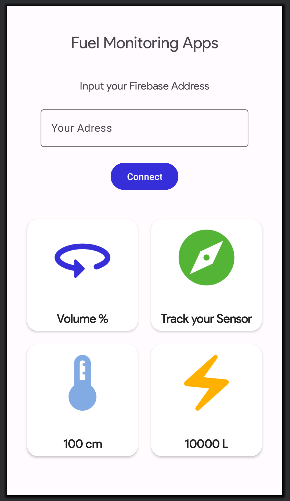

# Monitoring Fuel Volume in a cylinder tank through APPS based on IoT

Android APPS developed in kotlin to display Volume data From Sensor

  

## Features

**Simple UI:**
Provide all data records in 1 layout

**Real-Time Data Retrieval:**
Provide the recorded data from sensor continously 

**Wireless Communication:**
Builded with ESP32 to communicate wirelessly trough firebase database into android apps

**Compatibility with Different Sensors:** 
Still have a room for improvement for another sensor addition to ESP32 or the android apps itself

**Integration with ESP32 x Firebase Database:**
ESP32 to handle sensor and wifi communication
Firebase Database as a bridge between ESP32 and Android Apps

**GPS support in Android APPS for tracking sensor location:**
Capable to access the user location and the installed sensor location trough GPS

## How it Works
1. HCSR-04 reading the distance between the fuel surface and the sensor itself (in cm)
2. ESP32 handle the equation to measure fuel height (cm), Volume (liter) and the Volume percentage (%) 
3. ESP32 send the measured data (fuel height, volume, and volume percentage) to firebase database
4. Firebase database handle the whole recorded data
5. Firebase database send the measured data to android apps
6. Android Apps gives display of fuel height, volume, and volume percentage in real-time
7. Android Apps can provide location of the user and track the sensor in gps

## Important Note
This is a prototype, you can change the hcsr04 with the spesific sensor such as Fuel Level sensor for a 1:1 implementation
or you can still use this to measure non burnable fluid like water etc
The formula to measure volume can be different based on the container shape, or how the sensor implemented to get the cm data

## Reference
https://github.com/brandonhxrr/ESP
https://www.geludug.com/2013/05/menghitung-volume-cairan-pada-tanki.html
https://www.instructables.com/Measure-Fuel-Level-With-Arduino/

