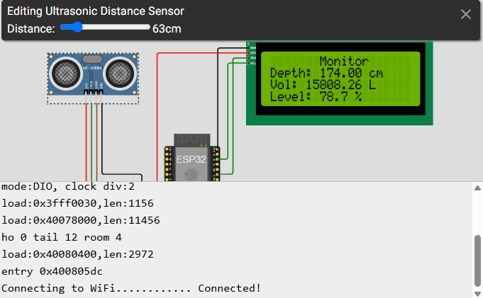
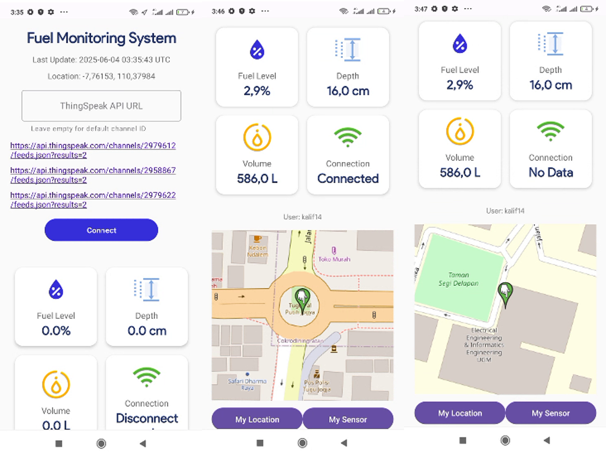

# Monitoring Fuel Volume in a cylinder tank through APPS based on IoT

Android APPS developed in kotlin to display Volume data From Sensor

  

    

## The Case
Fuel in a cylinder tank, horizontal position. we want to maeasure the volume of the liquid in the tank.
The sensor need to get the height of stored liquid (cm) and make an equation trough formula in the esp32

## Features

**Simple UI:**
Provide all data records in 1 layout

**Real-Time Data Retrieval:**
Provide the recorded data from sensor continously 

**Wireless Communication:**
Builded with ESP32 to communicate wirelessly trough thingspeak into android apps

**Compatibility with Different Sensors:** 
Still have a room for improvement for another sensor addition to ESP32 or the android apps itself

**Integration with ESP32 x Thingspeak Database:**
ESP32 to handle sensor and wifi communication
Thingspeak as a bridge between ESP32 and Android Apps

**GPS support in Android APPS for tracking app user and sensor location:**
Capable to access the user location and the installed sensor location trough GPS

## How it Works
1. HCSR-04 reading the distance between the fuel surface and the sensor itself (in cm)
2. ESP32 handle the equation to measure fuel height (cm), Volume (liter) and the Volume percentage (%) 
3. ESP32 send the measured data (fuel height, volume, and volume percentage) to thingspeak database
4. Thingspeak handle the whole recorded data
5. Android apps retrieve the data from thingspeak during the connection
6. Android Apps gives display of fuel height, volume, and volume percentage in real-time
7. Android Apps can provide location of the user and track the sensor in gps trough OpenStreetMap

## How to use apps
1. Open the apps
2. Give permission for gps
3. Turn on the gps
3. Get the right thingspeak url and submit it to connect
4. Tap connect for refreshment
5. Tap "My location" for user location
6. Tap My "sensor" for sensor location

## Important Note
This is a prototype, you can change the hcsr04 with the spesific sensor such as Fuel Level sensor for a 1:1 implementation
or you can still use this to measure non burnable fluid like water etc. Even you can implement another sensor to monitor another case.
The formula to measure volume can be different based on the container shape, position, or how the sensor implemented to get the cm data

## Reference
1. https://github.com/brandonhxrr/ESP
2. https://www.geludug.com/2013/05/menghitung-volume-cairan-pada-tanki.html
3. https://www.instructables.com/Measure-Fuel-Level-With-Arduino/

